# GDP Nowcasting App

A standalone MATLAB® App Designer application that wraps the Federal Reserve Bank of New York (FRBNY) open‑source **Dynamic Factor Model (DFM)** nowcasting codebase in a user‑friendly graphical interface. The app lets you estimate a dynamic factor model from mixed‑frequency macroeconomic data, produce a nowcast of quarterly GDP growth, decompose changes in the nowcast into the "news" from individual data releases, visualize the results, and interrogate the output through an integrated **AI Copilot** (OpenAI ChatGPT or a local Ollama model).

---

## Table of contents

1. [Features](#features)
2. [Requirements](#requirements)
3. [Installation](#installation)
4. [Repository layout](#repository-layout)
5. [Input file formats](#input-file-formats)
6. [Using the app](#using-the-app)
   - [1. Loading files](#1-loading-files)
   - [2. Configuring and running the model](#2-configuring-and-running-the-model)
   - [3. Reading the results](#3-reading-the-results)
   - [4. Figures](#4-figures)
   - [5. Exporting](#5-exporting)
7. [AI Copilot (LLM integration)](#ai-copilot-llm-integration)
   - [Installing the MATLAB LLM add-on](#installing-the-matlab-llm-add-on)
   - [Option A — OpenAI / ChatGPT (API key)](#option-a--openai--chatgpt-api-key)
   - [Option B — Ollama (local, free) on macOS](#option-b--ollama-local-free-on-macos)
   - [Option B — Ollama (local, free) on Windows](#option-b--ollama-local-free-on-windows)
   - [Using the Copilot in the app](#using-the-copilot-in-the-app)
8. [Understanding the two nowcast numbers](#understanding-the-two-nowcast-numbers)
9. [Troubleshooting](#troubleshooting)
10. [Credits and license](#credits-and-license)

---

## Features

- **Guided workflow** across tabbed panels: configure a run, view results, browse figures, chat with the AI Copilot, and read forecast detail.
- **Three‑file input model** — Spec file, Old data vintage, and New data vintage, each loadable from disk or from a bundled sample.
- **Hierarchical block + series filter** so you can see which indicators load on which factor blocks.
- **Full DFM estimation** (EM algorithm + Kalman filter/smoother) using the FRBNY engine (`dfm.m`).
- **News decomposition** between two data vintages (`update_nowcast.m` / `compute_news_table.m`): forecast, actual, weight, and impact for every released series.
- **Built‑in visualizations**: raw vs. transformed series, the common factor, and the projected GDP path.
- **AI Copilot** that reads the computed news table and answers plain‑language questions, backed by either OpenAI or a local Ollama server.

---

## Requirements

| Component | Requirement |
|---|---|
| **MATLAB** | R2026a recommended (the app was built and tested on it). R2024a or newer is required if you want the AI Copilot, because the MATLAB LLM add‑on needs R2024a+. |
| **App Designer** | Ships with MATLAB — no separate install. |
| **Operating system** | macOS or Windows |
| **Excel data readers** | The loaders use `readcell` / `readtable`, which work natively on macOS and Windows without Excel installed. |
| **AI Copilot (optional)** | The *Large Language Models (LLMs) with MATLAB* add‑on, plus **one** of: an OpenAI API key **or** a local Ollama installation. |

> If a specific MATLAB function reports a missing‑toolbox error on your installation, install the toolbox MATLAB names in the error. The DFM engine relies primarily on base MATLAB (`eigs`, `spline`, `filter`, `cov`, `std`, etc.).

---

## Installation

1. **Clone the repository:**

   ```bash
   git clone https://github.com/falveym/GDP-Nowcasting-App.git
   cd GDP-Nowcasting-App
   ```

2. **Open the project in MATLAB.** Either open the MATLAB project file from the *Home → Open* menu, or `cd` into the folder in MATLAB so the working directory is the repository root.

3. **Confirm the `functions` folder is on the path.** The example scripts call `addpath('functions')`; the app resolves files relative to the current folder (`pwd`), so launching MATLAB with the repo root as the working directory is the reliable setup.

4. **Launch the app** by opening `app1.mlapp` in App Designer and pressing **Run**, or by running the app's name from the Command Window once it is on the path.

> **Tip:** Because the app locates its sample data via `pwd`, always start it with the repository root as MATLAB's current folder. If a *Use Sample* button can't find a file, check that your current folder is the project root.

---

## Repository layout

```
GDP-Nowcasting-App/
├── app1.mlapp                    % The App Designer application
├── example_DFM.m                 % Script: estimate the DFM, save ResDFM.mat
├── example_Nowcast.m             % Script: run a nowcast + news decomposition
├── compute_news_table.m          % Helper: build the news table for the app
├── functions/
│   ├── dfm.m                     % Core DFM engine (EM + Kalman filter/smoother)
│   ├── update_nowcast.m          % Nowcast update + news decomposition (News_DFM, para_const)
│   ├── load_spec.m               % Reads the model specification workbook
│   ├── load_data.m               % Reads a data vintage workbook
│   ├── remNaNs_spline.m          % Missing-value handling
│   └── summarize.m               % Console data summary table
├── data/
│   └── US/                       % Dated .xls vintage files (e.g. 2016-12-23.xls) + cached mat/
├── Spec_US_example.xls           % Example US model specification
└── ResDFM.mat                    % Pre-estimated model results (sample)
```

---

## Input file formats

The app consumes standard FRBNY‑format Excel workbooks. There are two kinds.

### Specification file (`Spec_*.xls` / `.xlsx`)

A single worksheet describing the model. `load_spec.m` requires the following columns (header text is matched case‑insensitively, spaces removed):

- **SeriesID** — the mnemonic/series identifier (e.g. `GDPC1`, `INDPRO`, `PAYEMS`).
- **SeriesName** — human‑readable name.
- **Frequency** — `m` (monthly) or `q` (quarterly).
- **Units** — display units.
- **Transformation** — one of `lin, chg, ch1, pch, pc1, pca, log` (levels, difference, YoY difference, % change, YoY % change, annualized % change, natural log).
- **Category** — grouping label.
- **Model** — `1` to include a series in the model, `0` to drop it.
- **Block1 … BlockN** — factor‑loading structure. **Every modeled series must load on Block 1** (the global block), or `load_spec.m` stops with an error. Block column headers of the form `Block1-Global`, `Block2-Soft`, etc. become the block names.

### Data vintage file (`YYYY-MM-DD.xls` / `.xlsx`)

A workbook with a worksheet named **`data`**:

- **Row 1** — header row: the first cell is the date column label, the remaining cells are the series mnemonics (these must match the `SeriesID` values in the spec).
- **Column 1** — observation dates.
- **Remaining columns** — the raw (untransformed) observations, with `NaN`/blank for missing values.

A *vintage* is a snapshot of the data as it existed on a given date. The news decomposition compares an **old vintage** and a **new vintage**; the two files must be genuinely different snapshots (feeding identical data yields an empty news table by design).

> The first time a vintage is read, a cached `.mat` copy is written to a `mat/` subfolder next to the Excel file to speed up subsequent loads.

---

## Using the app
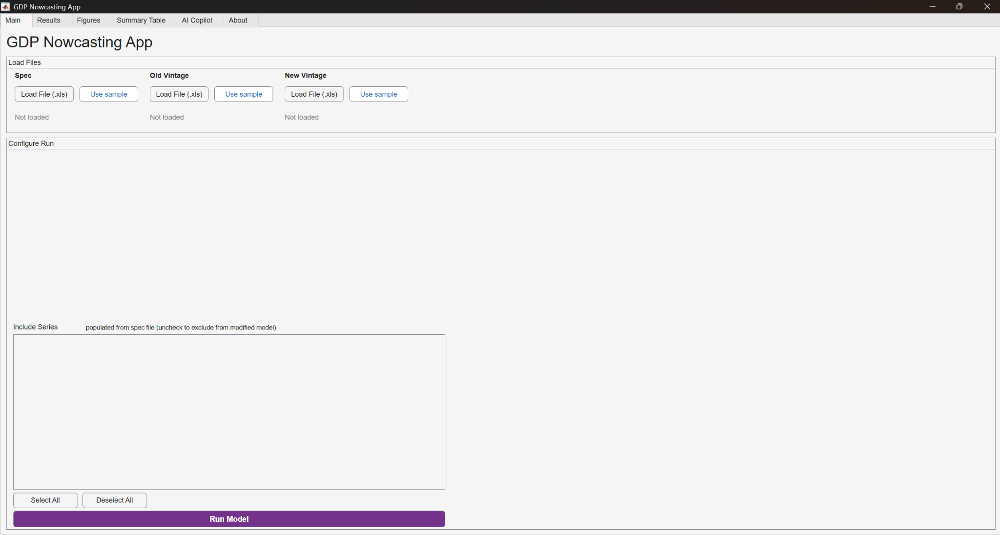

The app opens on the **Configure Run** (main) tab. The typical flow is: load files → pick your target series/period → run → inspect results and figures → export → ask the Copilot.

### 1. Loading files
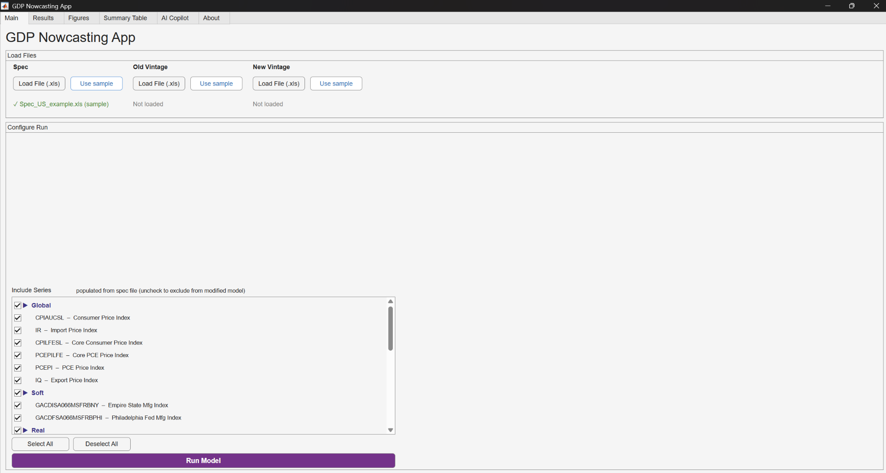


The file‑loading panel has 3 file loading columns, each with a **Load** button, a **Use Sample** button, and a status label:

| Slot | What it is | Required? |
|---|---|---|
| **Spec File** | The model specification workbook. | Yes |
| **Old Vintage** | Earlier data snapshot. | For news decomposition |
| **New Vintage** | Later data snapshot (the headline nowcast is built from this). | Yes |

- **Load** opens a file picker so you can choose your own workbook.
- **Use Sample** loads the bundled example (`Spec_US_example.xls`, the dated files in `data/US/`, and `ResDFM.mat`).
- On success the status label turns green and shows a check mark plus the filename, e.g. `✓ Spec_US_example.xls (sample)`. On failure it shows an inline red error message.

### 2. Configuring and running the model
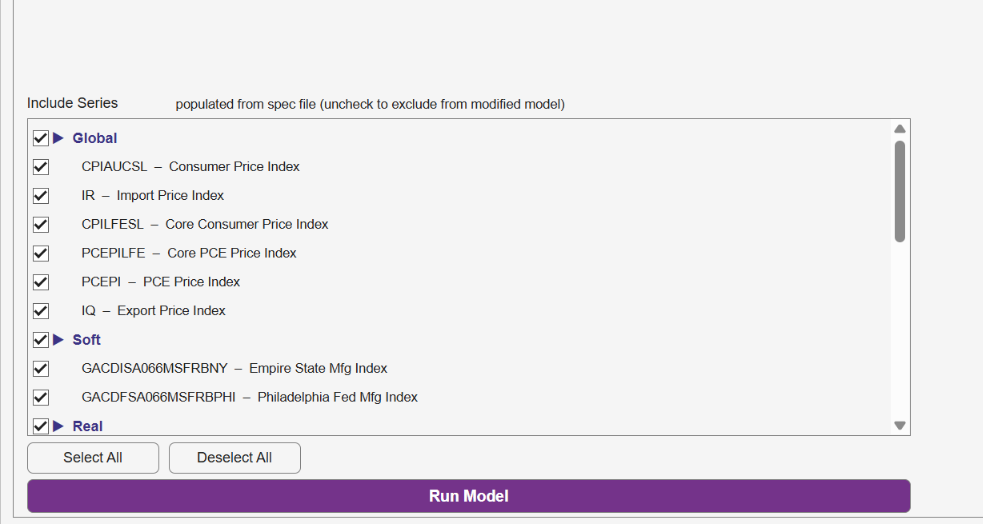
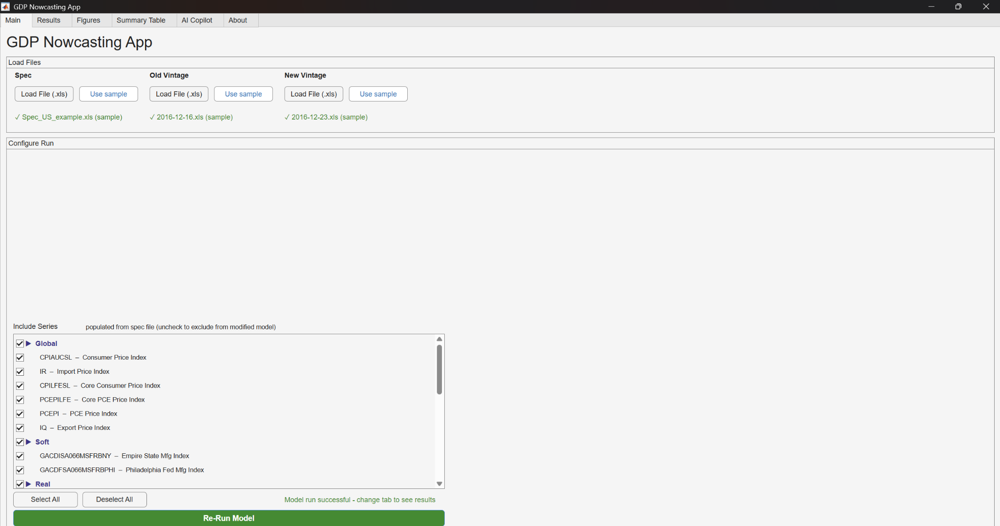

1. Use the **block + series filter** to review which indicators are included and how they load on the factor blocks.
2. Press **Run**. Under the hood the app calls the FRBNY engine:
   - It runs `dfm(X_new, Spec, threshold)` to estimate parameters (EM algorithm with a Kalman filter/smoother). This can take a little time for a full estimation; progress prints to the MATLAB Command Window.
   - It then computes the nowcast and, if both vintages are present, the **news decomposition** (`update_nowcast` / `compute_news_table`), producing a table of *Forecast, Actual, Weight, Impact* for each released series.

### 3. Reading the results
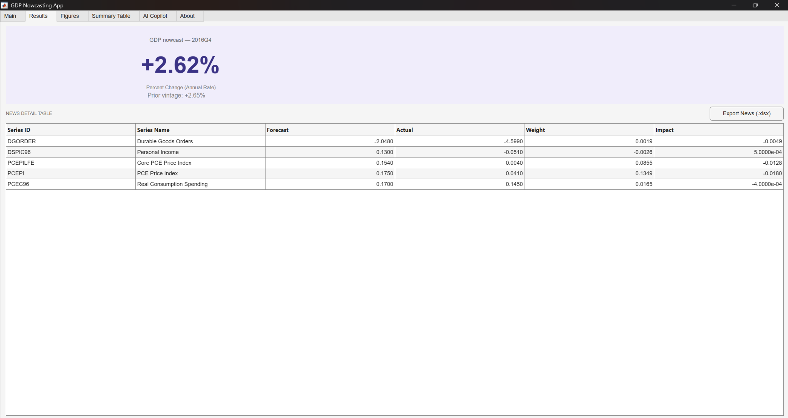

The **Results** tab shows the headline nowcast figures and summary statistics. The **Summary / Forecast Details** tab shows the per‑series news table — the same "Nowcast Detail Table" that the FRBNY `update_nowcast.m` prints to the console, restricted to series that had a new release between the two vintages. See [Understanding the two nowcast numbers](#understanding-the-two-nowcast-numbers) for how the two headline figures differ.

### 4. Figures
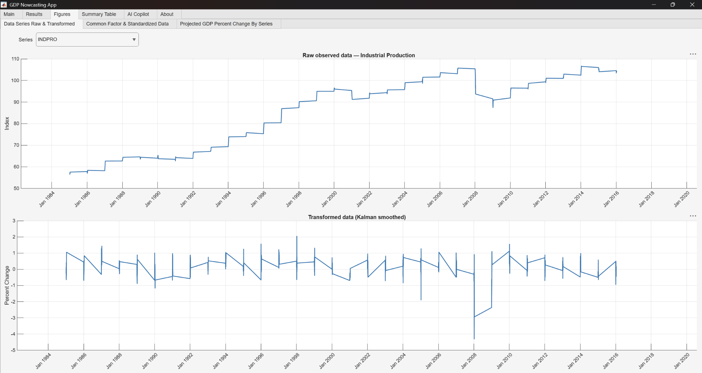

The **Figures** tab has nested sub‑tabs:

- **Data Series (Raw / Transformed)** — each indicator before and after its stationarity transformation.
- **Projected GDP Percent Change** — the model's implied GDP path.
- **Common Factor** — the estimated common factor and the standardized data it summarizes.

### 5. Exporting
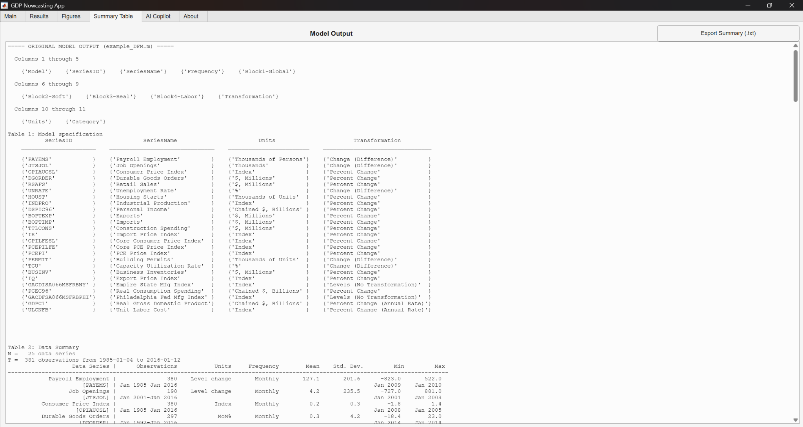
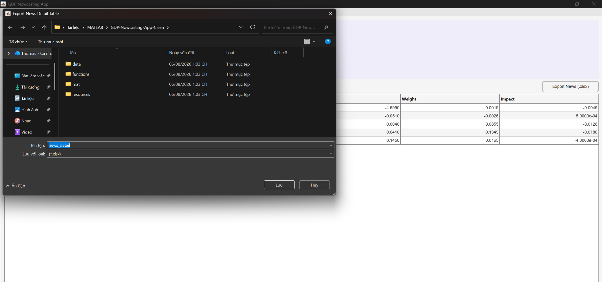
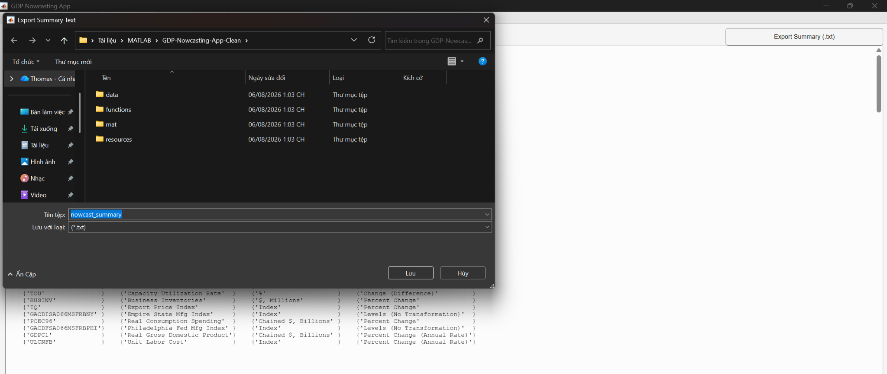

Use the export controls to save the computed outputs — the news/detail table and figures — to disk so they can be shared or embedded elsewhere. Tables are written with `writetable` (macOS/Windows‑safe); figures can be saved to standard image formats. Estimated model parameters are saved to a `ResDFM.mat` file, which you can later reload through the **Estimated Model** slot to reproduce a run without re‑estimating.

---

## AI Copilot (LLM integration)
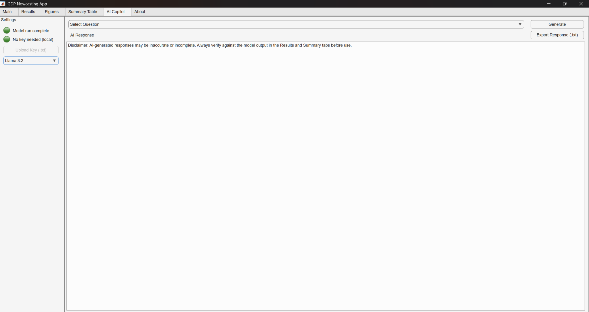
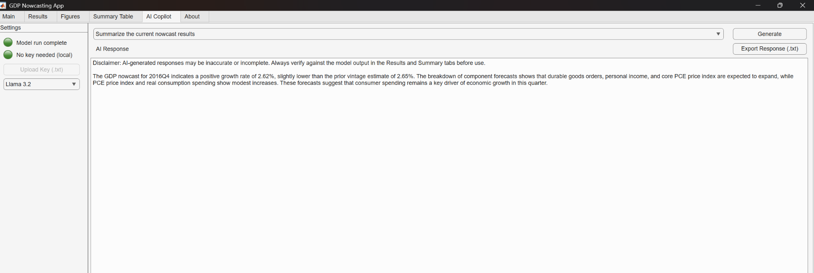

The **AI Copilot** tab lets you ask questions in plain English about the current nowcast and its news decomposition. It sends a compact, pre‑computed summary of the news table to a language model and returns the answer in the tab. Two backends are supported:

- **OpenAI / ChatGPT** — cloud, requires an API key, small per‑request cost (default model `gpt-4o-mini`).
- **Ollama** — a model running **locally** on your own machine, free and private (default model `llama3.2`).

Both backends are driven through MathWorks' official **Large Language Models (LLMs) with MATLAB** add‑on (`openAIChat`, `ollamaChat`, `generate`).

### Installing the MATLAB LLM add-on

1. In MATLAB, go to the **Home** tab → **Environment** section → **Add‑Ons**.
2. In the Add‑On Explorer, search for **`Large Language Models (LLMs) with MATLAB`**.
3. Click **Install**.

This add‑on requires **MATLAB R2024a or newer**. It is needed for *either* backend.

---

### Option A — OpenAI / ChatGPT (API key)

You need an OpenAI account and an API key. **You are responsible for any usage charges OpenAI applies.**

1. **Create a key.** Sign in at the OpenAI platform, open the **API keys** page, and create a new secret key. Copy it immediately (it is shown only once) — it looks like `sk-...`.

2. **Give the key to the app.** In the **AI Copilot** tab, select the **ChatGPT** backend and paste your key into the API‑key field (this is the "API key uploading" step). The app uses the key to construct an `openAIChat` object with `ModelName = "gpt-4o-mini"`.

   Alternatively, you can set the key as an environment variable so you don't paste it each session. Either use a `.env` file in the project root:

   ```
   OPENAI_API_KEY=sk-your-key-here
   ```

   loaded with `loadenv(".env")`, or set it directly in MATLAB before launching:

   ```matlab
   setenv("OPENAI_API_KEY", "sk-your-key-here");
   ```

   The add‑on reads the key via `getenv("OPENAI_API_KEY")`.

3. **Keep the key private.** Do not commit your key or `.env` file to Git. Add `.env` to `.gitignore`.

4. Ask a question in the Copilot tab. Requests go to OpenAI over the internet; a connection is required.

---

### Option B — Ollama (local, free) on macOS

Ollama runs an open model entirely on your Mac and exposes a local REST API on **port 11434**. No API key, no per‑token cost, and your data stays on your machine.

1. **Download and install.**
   - Go to <https://ollama.com/download>, download the macOS `.dmg`, and drag **Ollama** into your **Applications** folder.
   - Launch Ollama once. On first launch it offers to add the `ollama` command to your PATH — accept this so you can use it from Terminal.

2. **Pull the model** the app expects (`llama3.2`). Open **Terminal** and run:

   ```bash
   ollama pull llama3.2
   ```

   (This downloads a few GB. `llama3.2` / `llama3.2:3b` runs comfortably on machines with 8 GB RAM.)

3. **Make sure the server is running.** The Ollama desktop app starts the server automatically. To run it explicitly from Terminal:

   ```bash
   ollama serve
   ```

   Verify it is up:

   ```bash
   ollama list                       # shows models you've pulled
   curl http://127.0.0.1:11434/api/tags   # should return JSON, not an error
   ```

4. In the app's **AI Copilot** tab, select the **Ollama** backend. On connecting, the app runs a preflight check by calling `http://127.0.0.1:11434/api/tags`; if the server is reachable you're ready to chat.

---

### Option B — Ollama (local, free) on Windows

1. **Download and install.**
   - Go to <https://ollama.com/download>, download the **Windows** installer, and run it. Ollama installs natively and starts a background service listening on **port 11434**.

2. **Pull the model.** Open **PowerShell** or **Command Prompt** and run:

   ```powershell
   ollama pull llama3.2
   ```

3. **Confirm the server is running.**

   ```powershell
   ollama list
   curl http://127.0.0.1:11434/api/tags
   ```

   If the service isn't running, start it with:

   ```powershell
   ollama serve
   ```

   > On Windows, Ollama automatically uses a compatible NVIDIA (CUDA) or AMD (ROCm) GPU if present — no manual configuration needed.

4. In the **AI Copilot** tab, select **Ollama**. The app pings `http://127.0.0.1:11434/api/tags` to confirm connectivity before enabling chat.

---

### Using the Copilot in the app

1. Run a nowcast first so there is a news table for the Copilot to read.
2. Open the **AI Copilot** tab and pick a backend (**ChatGPT** or **Ollama**).
3. Provide credentials if using ChatGPT (paste the API key), or confirm the Ollama server is reachable.
4. Select a prompt — for example, "Summarize the current nowcast results" — and submit.

The app anchors the model's answer to the **Impact** column of the exported news table, so responses stay grounded in the numbers actually computed. For economist‑grade reliability, a larger backend model (for example, a bigger Ollama model, memory permitting, or a larger OpenAI model) generally gives more dependable readings than the lightweight defaults.

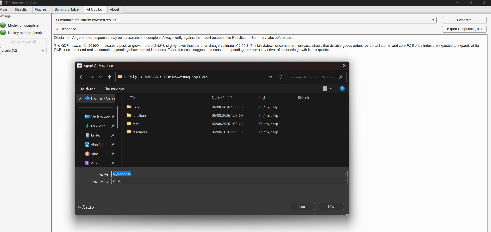 
---

## Understanding the two nowcast numbers

The app reports two related GDP figures that are computed differently **by design**:

- **Headline nowcast (`NowcastValue`)** — derived from the full Kalman‑smoothed path (`y_new`), which includes the idiosyncratic AR component. This is the canonical headline number.
- **Common‑component nowcast (`NowcastQoQ`)** — a projection using the common factors only. It is a "common‑component view" and will generally differ from the headline figure.

Seeing the two values disagree is expected; they answer slightly different questions (full model path vs. common‑factor contribution).

---

## Troubleshooting

| Symptom | Likely cause / fix |
|---|---|
| *Use Sample* can't find a file | MATLAB's current folder isn't the repo root. `cd` to the project root and relaunch. |
| `SeriesID '…' not found in the data file headers` | A spec mnemonic doesn't match a column header in the data workbook. Align `SeriesID` with the data headers. |
| `All variables must load on global block` | A modeled series has `0` in the Block 1 column. Every included series must load on Block 1. |
| Empty news table | The old and new vintages are identical (or too similar). Use two genuinely different snapshots. |
| Copilot: "connection refused" (Ollama) | The Ollama server isn't running. Run `ollama serve` and confirm `curl http://127.0.0.1:11434/api/tags` returns JSON. |
| Copilot: model not found (Ollama) | You haven't pulled the model. Run `ollama pull llama3.2`. |
| Copilot: OpenAI auth error | The API key is missing, mistyped, or unset. Re‑enter it or set `OPENAI_API_KEY`. |
| Copilot tab does nothing | The *Large Language Models (LLMs) with MATLAB* add‑on isn't installed. Install it from the Add‑On Explorer. |

---

## Credits and license
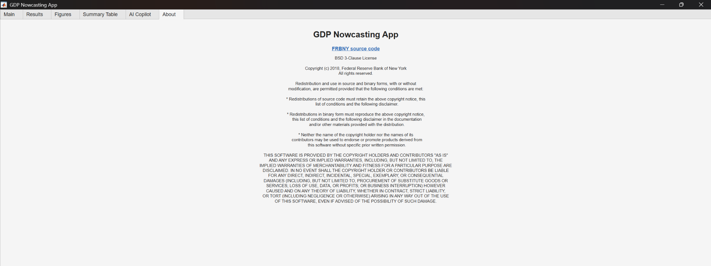 

- The nowcasting engine (`dfm.m`, `update_nowcast.m`, `News_DFM`, `para_const`, `remNaNs_spline.m`, Kalman filter/smoother routines) is based on the **Federal Reserve Bank of New York** open‑source *Nowcasting* replication code, in turn implementing Bańbura, Giannone & Reichlin (2010), "Nowcasting", in Clements & Hendry (eds.), *Oxford Handbook on Economic Forecasting*. Please retain those acknowledgements in any published work.
- The GUI, visualizations, export tooling, and AI Copilot integration are original additions in this repository.
- LLM connectivity is provided through MathWorks' *Large Language Models (LLMs) with MATLAB* add‑on.

See the `LICENSE` file in the repository for license terms.
